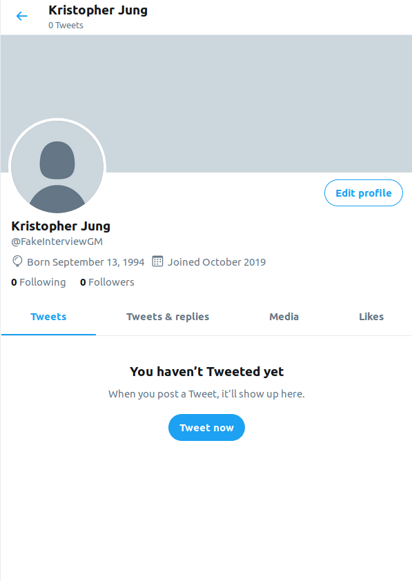
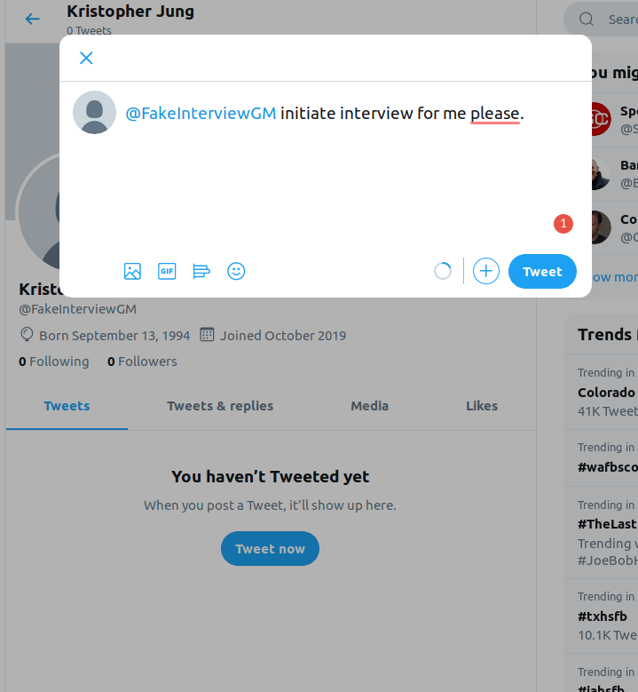
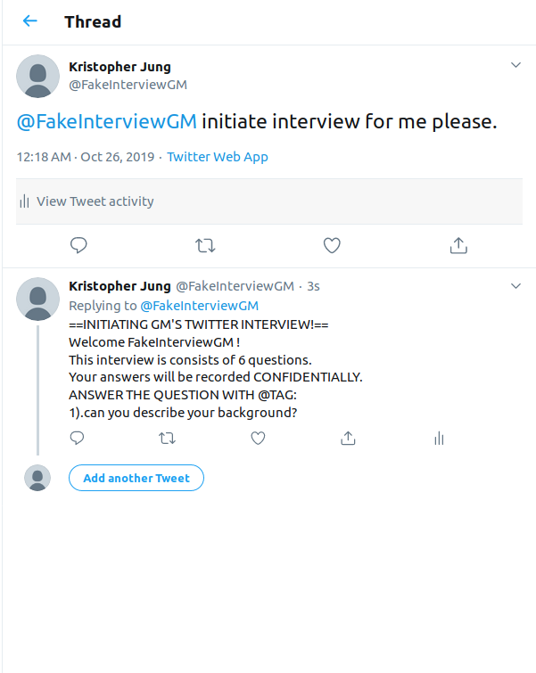
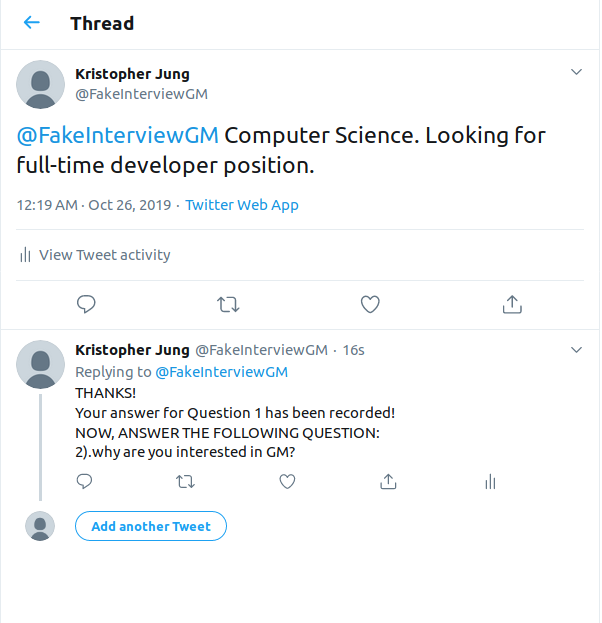
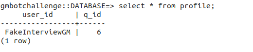
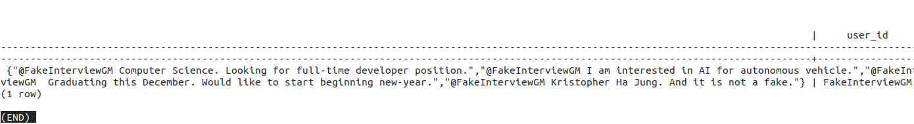
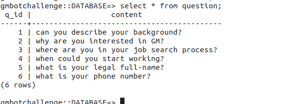

# twitterBotChallenge
Submission repository for twitterBotChallenge by CSClub&GM

  
  <a href="https://www.linkedin.com/in/kristopher-jung-a7339a15a/"> LinkedIn Profile ! </a>
  

<h1> HowTo </h1>

<ol> 
  <li> tag @FakeInterviewGM and say anything to initialize </li>
  <li> tag @FakeInterviewGM to respond to the question and receive a new question </li>
  <li> Bot cannot talk to Bot itself. This will cause infinite loop so I blocked it </li>
</ol> 

</img>

Tweet to @FakeInterviewGM to initiate interview process.
  
  

</img>

  
Like this.
  

</img>

answer bot's interview. Don't forget to tag @FakeInterviewGM to keep progress.
  

</img>

Like this.
  

</img>

  
  Information has been kept in database. Do not provide anything real for this fake interview.
  

</img>

</img>

Used <a href="https://github.com/gunthercox/ChatterBot"> pre-trained ChatterBot </a>
Documentation provided <a href="https://chatterbot.readthedocs.io/en/stable/"> Here </a>

